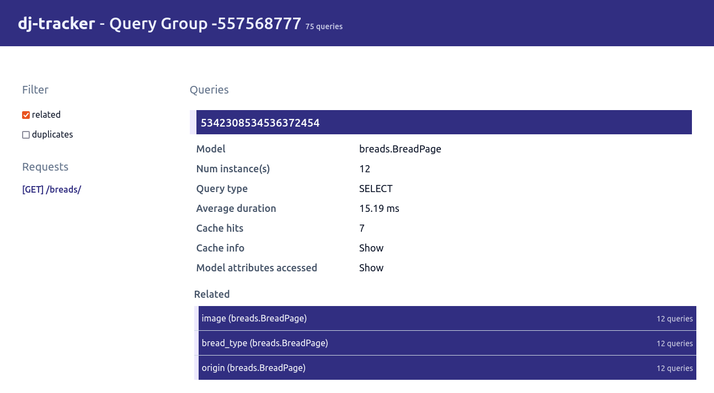

# Dasboard

This page gives an overview of the `dj-tracker` dashboard structure.

## Dashboard

The trackings dashboard is available at `/dj-tracker/`. It shows the latest and most visited URLs along with various insights into your queries:

## Requests

The `/dj-tracker/requests/` endpoint lists all requests tracked. It allows sorting them by date, path or number of occurrences but also filtering them to only show those where a N+1 situation was detected.

When you click in one of the requests shown in the dashboard, it will redirect to a page showing the different query groups for that request.

## Query groups

A query group, as the name suggests, is a group of queries that occur together; generally inside a full request-response cycle.

The list of all query groups is available at `/dj-tracker/query-groups/`. It allows sorting them by date, number of queries or number of occurrences. Similar to the requests page, it also allows filtering query groups to only show those where a N+1 situation was detected.

Clicking on one of the query groups displayed will show all the queries in that group with some statistics associated to them. It also gives the ability to only show duplicate queries or queries that induced other ones (`Related queries`).

## Queries

All queries tracked are available at `/dj-tracker/queries/`. It allows sorting them by average duration, number of occurrences or number of instances. The list can be filtered by model or query type.

Clicking on of the queries will display various information about a query: the traceback, the SQL generated, fields usage but also hints on how to improve the query:

