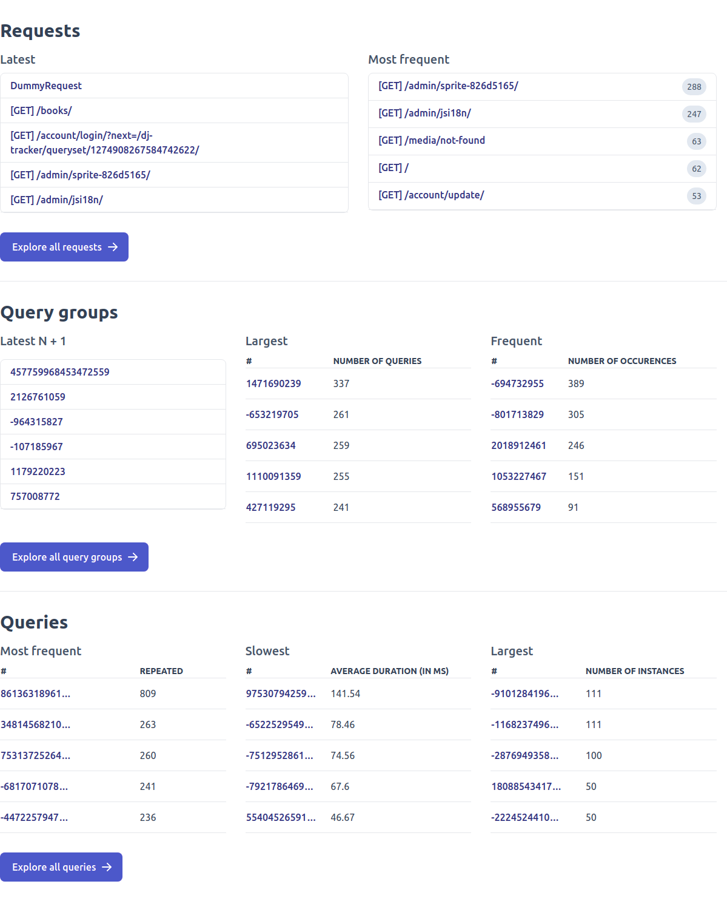

# Dasboard

This page gives an overview of the `dj-tracker` dashboard structure.

## Dashboard

The trackings dashboard is available at `/dj-tracker/`. It shows the latest and most visited URLs along with various insights into your queries and fields:

## Requests

When you click in one of the requests shown in the dashboard, it will redirect to a page showing the different query groups for that request along with how much time they occured.

## Query groups

Clicking on one of the query groups displayed in a request's page will show all the queries in that group with some statistics associated to them. It also gives the ability to only show duplicate queries or queries that induced other ones (`Related queries`).

## Query

Clicking on of the queries displayed in query group will display various information about a query: the traceback, the SQL generated, fields usage but also hints on how to improve the query:

