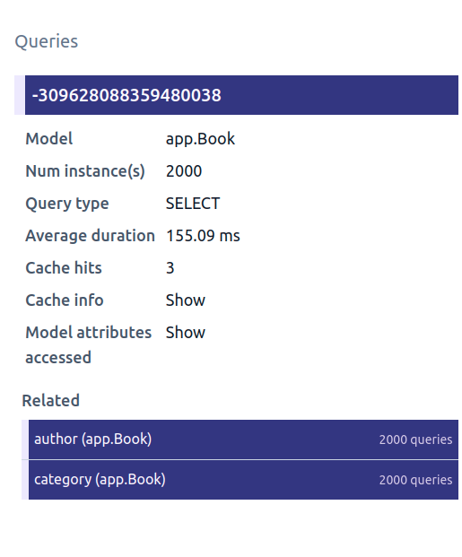
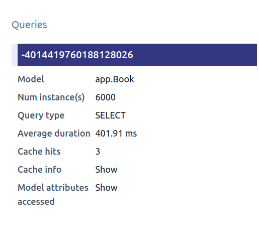
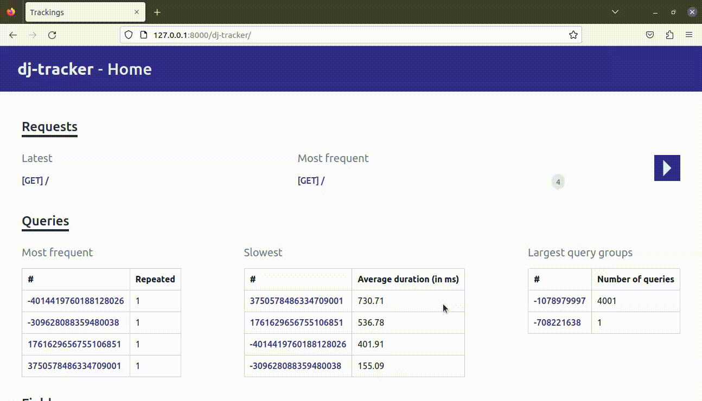

# Detect and resolve related queries

In the previous section, we set up a simple view and noticed, after some profiling, that it's particularly slow.

## Detecting related queries

If you didn't see them in the previous step, here are the informations that `dj-tracker` shows for our books query:



Apart from the various information on the query itself, we can see that 2000 queries were made via the `author` and `category` fields for our 2000 book instances. In other terms, we're making 2 additional queries for each `Book` instance of our initial queryset a.k.a (2)N + 1. This is very inefficient and the number of queries will keep increasing as we add more `Book` instances.

## Resolving related queries

In our situation, we can use the `select_related` method to fetch all books' authors and categories in a **single** query.

Let's update our view as follows:

```python
def books_list(request):
    context = {
        "books": Book.objects.select_related("author", "category")
    }
    return render(request, "books.html", context)
```

and run our benchmark:

```shell
Time in ms (25 calls) - Min: 112.99, Max: 165.69, Avg: 129.65

Memory - size in KiB (25 calls) - Min: 17584.45, Max: 17974.71, Avg: 17627.35
Memory - peak in KiB (25 calls) - Min: 18732.30, Max: 19122.25, Avg: 18775.29
```

Our view renders in just 130ms now! That's more than 10x speedup compared to our previous version in terms of speed gains. We can also notice that this version uses 2Mb less memory.

Refer to the Django documentation for more information on [`select_related`](https://docs.djangoproject.com/en/4.1/ref/models/querysets/#select-related) and [`prefetch_related`](https://docs.djangoproject.com/en/4.1/ref/models/querysets/#prefetch-related).

## Summary

In the query group view, `dj-tracker` will group all queries that come from the same field in a queryset along with the number of times it happened.

You can then visually tell if you have a N+1 when the number of instances in an initial query is equal to the number of queries that come from a field of the corresponding model.

Depending on the type of the field, you can either use `select_related` or `prefetch_related` to avoid the related queries.

## How it looks?

Here is the information that `dj-tracker` shows with our new changes:



You can see that we no longer have the `Related` section but the number of instances shown is now 6000 representing `2000 Book + 2000 Author + 2000 Category`.

We can click on the query id to have even more information about it (SQL generated, traceback, fields usage...):



The [next steps](./use_only_or_defer.md) will show how we can use those informations to improve our query.
