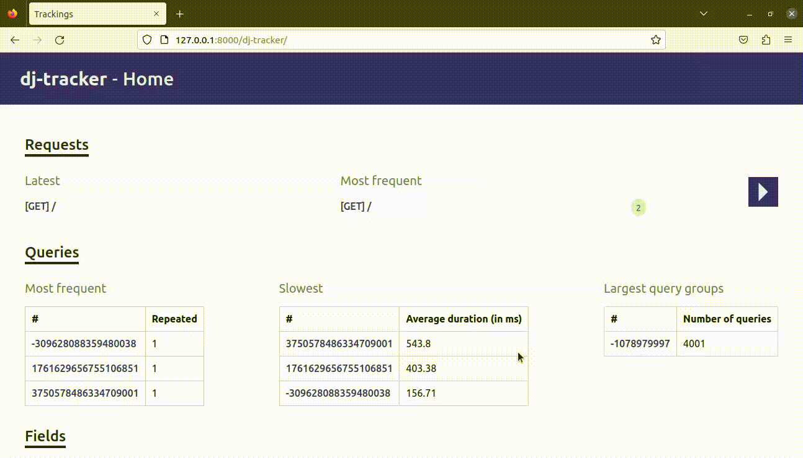

# Tutorial

This tutorial shows how you can use `dj-tracker` to monitor and improve your queries.

We'll take the example of building a page that shows all books of a library.

The source code is available in the [`tutorial` directory](https://github.com/Tijani-Dia/dj-tracker/tree/main/tutorial). The [README](https://github.com/Tijani-Dia/dj-tracker/tree/main/tutorial/README.md) contains instructions to set up the project locally. However, it isn't required and you can just follow along to understand how you might use it in your own project.

## Models

We'll work with the following models:

```python
from django.db import models


class Category(models.Model):
    name = models.CharField(max_length=64)


class Author(models.Model):
    first_name = models.CharField(max_length=64)
    last_name = models.CharField(max_length=64)
    date_of_birth = models.DateTimeField()
    date_of_death = models.DateTimeField(null=True, blank=True)
    biography = models.TextField()


class Book(models.Model):
    title = models.CharField(max_length=255)
    summary = models.TextField()
    author = models.ForeignKey(Author, on_delete=models.CASCADE)
    category = models.ForeignKey(Category, on_delete=models.CASCADE)
```

We also define some factories to build `Book` instances to work with:

```python
import factory

from .models import Author, Book, Category


class CategoryFactory(factory.django.DjangoModelFactory):
    class Meta:
        model = Category

    name = factory.Faker("word")


class AuthorFactory(factory.django.DjangoModelFactory):
    class Meta:
        model = Author

    first_name = factory.Faker("first_name")
    last_name = factory.Faker("last_name")
    date_of_birth = factory.Faker("date_of_birth")
    date_of_death = factory.Faker("date_time_this_century")
    biography = factory.Faker("text", max_nb_chars=5000)


class BookFactory(factory.django.DjangoModelFactory):
    class Meta:
        model = Book

    title = factory.Faker("sentence")
    summary = factory.Faker("text", max_nb_chars=2500)
    author = factory.SubFactory(AuthorFactory)
    category = factory.SubFactory(CategoryFactory)


create_books = BookFactory.create_batch
```

Keep in mind how we set a large content for the `summary` and `biography` fields.

In a terminal, we create 2000 books to work with:

```console
python manage.py shell -c  "from app.factories import create_books; create_books(2000)"
```

## View - Template

The view that shows all books in the database is defined as follow:

```python
from django.shortcuts import render

from .models import Book


def books_list(request):
    books = Book.objects.all()
    return render(request, "books.html", {"books": books})
```

and this is the corresponding template:

```html

    <h4>{{ book.title }}</h4>
    <dl>
        <dt>Author</dt>
        <dd>{{ book.author.first_name }} {{ book.author.last_name }}</dd>

        <dt>Category</dt>
        <dd>{{ book.category.name }}</dd>
    </dl>

```

## URLs

To see how our view performs, we have additional `/time/` and `/memory/` endpoints to track timings and memory usage:

```python
from django.urls import path

from .profile import MemoryProfiler, TimeProfiler
from .views import books_list

urlpatterns = [
    path("", books_list),
    path("time/", TimeProfiler(books_list)),
    path("memory/", MemoryProfiler(books_list)),
]
```

## Profiling

We'll use the following methodology to profile the view:

-   Make 25 requests sequentially to the `/time/` endpoint
-   Make 25 requests sequentially to the `/memory/` endpoint
-   Make 1 request to the books endpoint with `dj-tracker` running

We run each of these steps in a new process to have consistent results.

Let's now run the first benchmark to see how our view performs:

```shell
Time in ms (25 calls) - Min: 1681.04, Max: 1981.69, Avg: 1740.82

Memory - size in KiB (25 calls) - Min: 19684.88, Max: 20065.00, Avg: 19788.62
Memory - peak in KiB (25 calls) - Min: 21044.07, Max: 21425.05, Avg: 21147.91
```

Our view takes up to 2s to render and uses around 20Mb in average (in my machine)!

## `dj-tracker` dashboard

If we now go to the `/dj-tracker/` endpoint, we can see that we're making 4001 queries:



In the [following steps](./detect_and_resolve_related_queries.md), we'll take a closer look at the informations `dj-tracker` gives us to see how we can improve our view.
