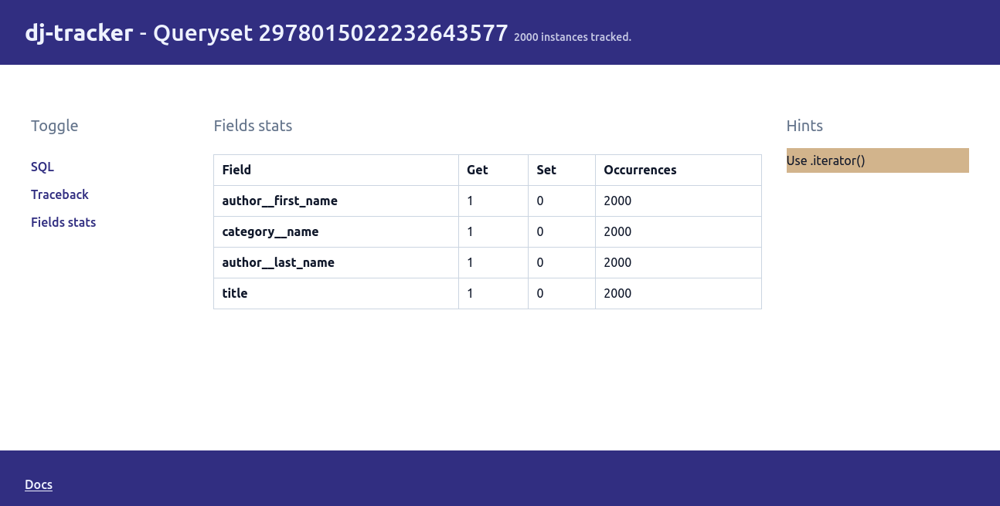

# `iterator` usage

From the [Django docs](https://docs.djangoproject.com/en/4.0/ref/models/querysets/#only):

> When you have a lot of objects, the caching behavior of the QuerySet can cause a large amount of memory to be used. In this case, iterator() may help.

`dj-tracker` can show how effective the caching behavior of QuerySets is via the `cache_hits` field:


`dj-tracker` will show a `Use .iterator` hint when the number of cache hits is equal to 1 (i.e when we use instances of a queryset only once).

## Example

In our example, we're using every book instance once: when we render them in the template. However, Django's for template tag [checks the length of the iterable passed or converts it into a list if it doesn't implement the `__len__` method](https://github.com/django/django/blob/main/django/template/defaulttags.py#L192-L194). This means that the cache hits will at least be 2 if we use the `` templatetag: one cache hit to get the length and another one for when we actually iterate over the sequence. That's the reason why `dj-tracker` doesn't show this hint for our queryset.

For the sake of this tutorial, we'll use a [custom templatetag](https://github.com/Tijani-Dia/dj-tracker/tree/main/tutorial/app/templatetags/iterate_tags.py) which behaves similarly to the `for` tag, except that it doesn't check the length nor converts the iterable passed into a list beforehand. By the way, the queryset's cache is hit once. We update our template as follows:

```html



    {{ book.title }} -({{ book.author__first_name }} {{ book.author__last_name }}) - {{ book.category__name }

```

If we go to the books endpoint with `dj-tracker` running, we'll now see the `Use .iterator` hint:



## View

Let's go ahead and update our view to use `.iterator`:

```python
def books_list(request):
    only = ("title", "category__name", "author__first_name", "author__last_name")
    context = {
        "books": Book.objects.select_related("author", "category")
        .only(*only)
        .values(*only)
        .iterator()
    }
    return render(request, "books.html", context)
```

and run the benchmarks:

```console
Time in ms (25 calls) - Min: 42.37, Max: 63.76, Avg: 48.04

Memory - size in KiB (25 calls) - Min: 142.85, Max: 381.54, Avg: 154.87
Memory - peak in KiB (25 calls) - Min: 1537.41, Max: 1776.59, Avg: 1550.21
```

Our timings haven't changed much but we are now only using 0.15MB in average (the previous average was 1MB) with a max peak at 1.5MB. That's a very nice memory improvement without trading off speed.

## Summary

`dj-tracker` can show effective a queryset's cache is and give hints on when to use the [`iterator`](https://docs.djangoproject.com/en/4.0/ref/models/querysets/#iterator) method.

Since the hint is solely based on the cache hits, it may be up to you to figure out what happens when you think that your instances should only be used once but they aren't. Also, it's worth taking into consideration that the `.iterator` optimisation is mostly useful when you have a **lot** of objects as it can consume more time and memory when that is not the case.
