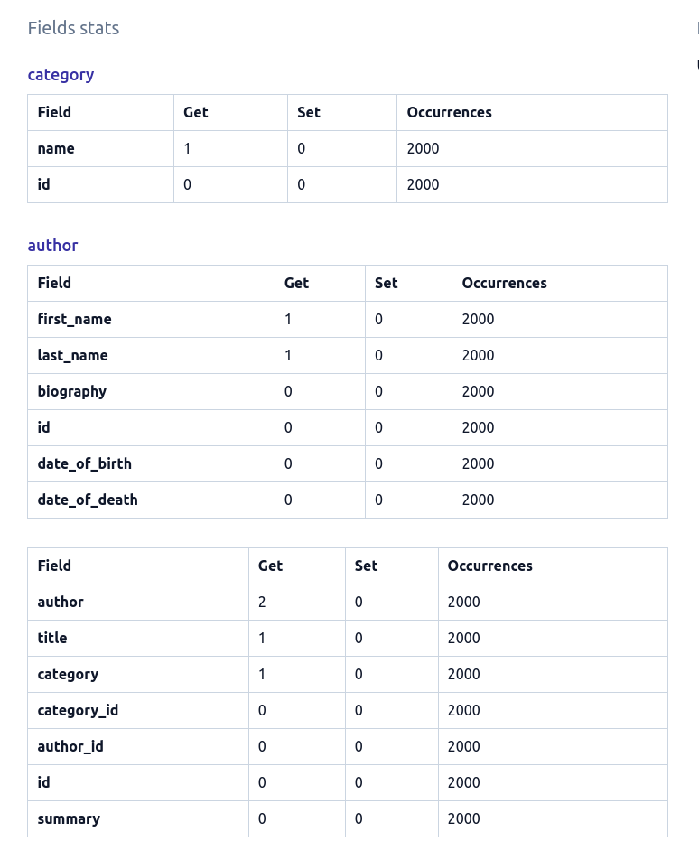

# `only`/`defer` usage

The Field Stats section of a query page shows how much time each field has been accessed for each instance in a queryset.

It shows a main table corresponding to the main model of a queryset and in cases where we have other instances related to the main model, it shows a separate table for each related model.

This is what the field stats look like for our books query:



We can see that only the `author`, `category` and `title` fields were accessed for the `Book` instances. Similarly, only the `first_name` and `last_name` were accessed for the `Author` instances and `name` for `Category` instances.

---

The field stats table shows all fields that were _loaded from the database_. Therefore, you'll generally see the primary key field (`id` in our example) in the stats even if we you don't use it in your own code because [Django will automatically load the primary key](https://docs.djangoproject.com/en/4.0/ref/models/querysets/#django.db.models.query.QuerySet.defer).

---

## `only`/`defer`

In these situations, we can use the `only` method of QuerySets to only fetch the values we're interested in.

Let's update our view as follows:

```python
def books_list(request):
    books = Book.objects.select_related("category", "author").only(
        "title",
        "category__name",
        "author__first_name",
        "author__last_name",
    )
    return render(request, "books.html", {"books": books})
```

And run our profilers:

```shell
Time in ms (10 calls) - Min: 193.54, Max: 238.62, Avg: 219.09

Memory - size in KiB (10 calls) - Min: 5485.70, Max: 5855.15, Avg: 5698.45
Memory - peak in KiB (10 calls) - Min: 8448.93, Max: 8819.18, Avg: 8658.94
```

We can notice a small speed gain of around 30ms in average. However, we're now just using around 5.7MB; compared the previous 35MB we were using, it's a huge improvement - mostly explained by the fact that we're no longer loading the large `summary` and `biography` fields.

If we go to the query view, the fields stats will now look like this:


---

You can notice that the `author_id` and `category_id` are still being loaded even if we don't use it in our code. However, they're required for the `select_related` to work. This behaviour is detailed in the defer section of QuerySets in the Django docs (linked in note above).

---

## Summary

`dj-tracker` shows all fields usage in a queryset. We can use that information to apply the [`only`](https://docs.djangoproject.com/en/4.0/ref/models/querysets/#only) or [`defer`](https://docs.djangoproject.com/en/4.0/ref/models/querysets/#defer) optimisations when we notice that some fields aren't being used.

I highly recommend reading the various notes on the docs of `only` and `defer` and take them into consideration when you apply these optimisations.

Back to our query, you may (or not) have seen in the `Hints` section of the query page that `dj-tracker` suggests using `.values` or `.values_list`. Check out the [next page](./use_values_or_values_list.md) to learn more about it.
