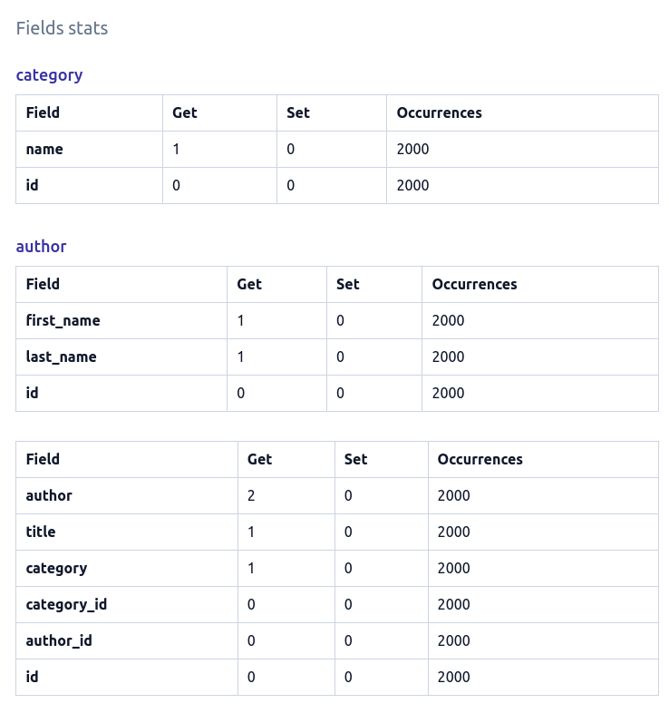

# `only`/`defer` usage

The Field Stats section of a query page shows how much time each field has been accessed for each instance in a queryset.

It shows a main table corresponding to the main model of a queryset.

In cases where we have other instances related to the main model, it shows a separate table for each related model.

This is what the field stats look like for our books query:


We can see that only the `author`, `category` and `title` fields were accessed for the `Book` instances. Similarly, only the `first_name` and `last_name` were accessed for the `Author` instances and `name` for `Category` instances.

Also, remember that the `biography` and `summary` fields can contain very large text but we aren't using them to render our template.

## `only`/`defer`

In these situations, we can use the `only` method of QuerySets to only fetch the values we're interested in.

Let's update our view as follows:

```python
def books_list(request):
    context = {
        "books": Book.objects.select_related("author", "category").only(
            "title", "category__name", "author__first_name", "author__last_name"
        )
    }
    return render(request, "books.html", context)
```

And run our profilers:

```shell
Time in ms (25 calls) - Min: 100.20, Max: 148.85, Avg: 115.76

Memory - size in KiB (25 calls) - Min: 2702.77, Max: 3028.50, Avg: 2735.80
Memory - peak in KiB (25 calls) - Min: 3850.62, Max: 4175.73, Avg: 3883.74
```

We can notice a small speed gain of around 15ms in average. However, we're now just using around 2.7MB; compared the previous 17.6MB we were using, it's a huge improvement.

If we go to the query view, the fields stats will now look like this:



## Summary

`dj-tracker` shows all fields usage in a queryset making it easy to apply the [`only`](https://docs.djangoproject.com/en/4.0/ref/models/querysets/#only) and [`defer`](https://docs.djangoproject.com/en/4.0/ref/models/querysets/#defer) optimisations.

You may (or not) have seen in the `Hints` section of the query page that `dj-tracker` suggests using `.values` or `.values_list`. Check out the next page to learn more about it.
