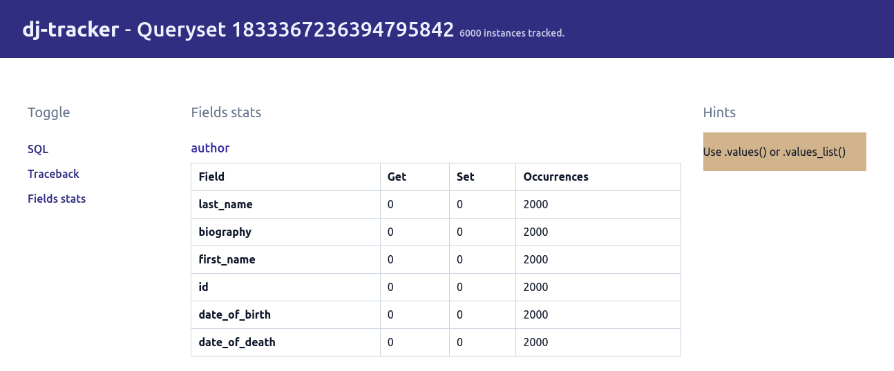
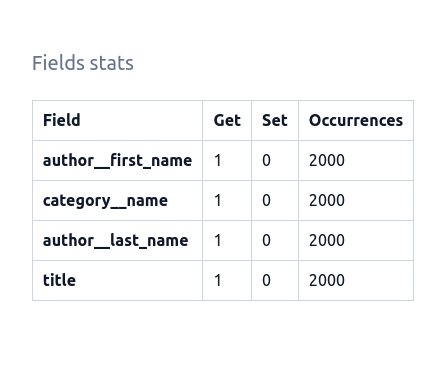

# `values`/`values_list` usage

When `dj-tracker` detects that no model attributes/methods, except the ones needed to build model instances, are used for all instances of a queryset; it'll hint at using the [`.values` or `.values_list`](https://docs.djangoproject.com/en/4.1/topics/db/optimization/#use-queryset-values-and-values-list) methods.

In our example, we're only using raw model fields, namely `title`, `category.name`, `author.first_name` and `author.last_name`; we aren't using any method or such. Therefore it's a candidate for the `Use values/values_list` hint:



## View - Template

Let's update our view to use `.values`:

```python
def books_list(request):
    books = Book.objects.values(
        "title",
        "category__name",
        "author__first_name",
        "author__last_name",
    )
    return render(request, "books.html", {"books": books})
```

---

Django will only fetch the fields we passed in to the `.values` method, so we can remove the `.only` call as it's redundant. See docs on the [`.values`](https://docs.djangoproject.com/en/4.0/ref/models/querysets/#values) method.

---

Our query will now return dictionary objects instead of model instances. An instance will have the following structure:

```python
{
    "title": "Harry Potter",
    "category__name": "Science Fiction",
    "author__first_name": "Joanne",
    "author__last_name": "Rowling"
}
```

Let's update our template to match this new structure:

```html

<h4>{{ book.title }}</h4>
<dl>
  <dt>Author</dt>
  <dd>{{ book.author__first_name }} {{ book.author__last_name }}</dd>

  <dt>Category</dt>
  <dd>{{ book.category__name }}</dd>
</dl>

```

## Profile

Let's now run our profilers to see how our view performs:

```console
Time in ms (25 calls) - Min: 39.77, Max: 64.72, Avg: 44.71

Memory - size in KiB (25 calls) - Min: 1219.71, Max: 1365.07, Avg: 1241.87
Memory - peak in KiB (25 calls) - Min: 2578.51, Max: 2724.15, Avg: 2600.67
```

Our new version is in average 2x faster (previous average was 107.6ms) and uses 2.5x less memory as well.

This can be explained by the fact that creating and manipulating dictionaries is cheaper than doing the same with model instances - both in speed and in memory terms.

This is now what the field stats for our query look like:



## Summary

`dj-tracker` keeps track of every model atribute/method access to provide hints on when to use the [`.values`](https://docs.djangoproject.com/en/4.0/ref/models/querysets/#values) or [`.values_list`](https://docs.djangoproject.com/en/4.0/ref/models/querysets/#values-list) optimisations.

Another valuable optimisation method that `dj-tracker` can give hints about is the `.iterator` method. Check out the [next steps](./use_iterator.md) for more on this.
